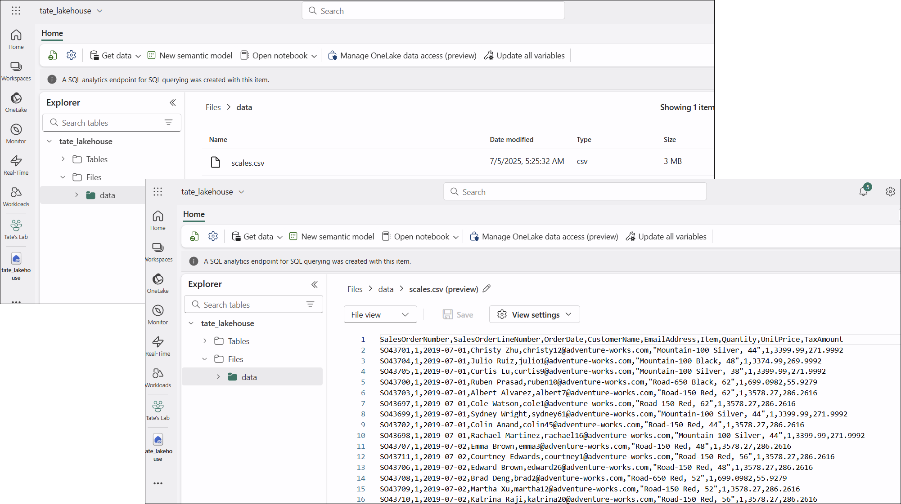
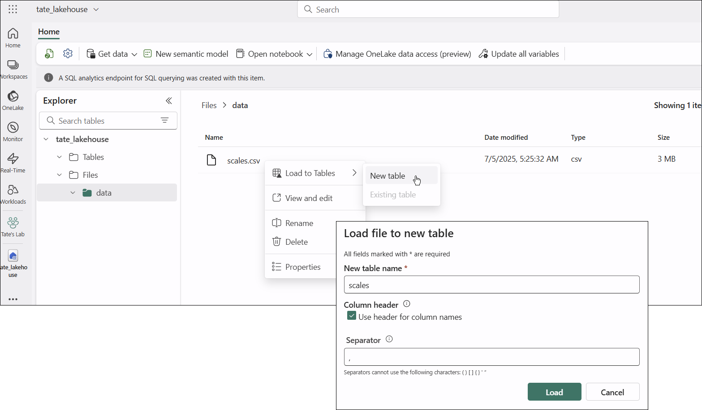

# Microsoft Fabric Learning Paths

<!-- omit in toc -->
## Contents
- [Learning Path: Get Started with Microsoft Fabric](#learning-path-get-started-with-microsoft-fabric)
  - [What is Microsoft Fabric?](#what-is-microsoft-fabric)
    - [OneLake](#onelake)
    - [Workspaces](#workspaces)
    - [Microsoft Fabric, AWS, and Google Cloud](#microsoft-fabric-aws-and-google-cloud)
    - [Administration and Governance](#administration-and-governance)
    - [Data Teams and Microsoft Fabric](#data-teams-and-microsoft-fabric)
      - [Traditional Roles and Challenges](#traditional-roles-and-challenges)
      - [Evolution of Collaborative Workflows](#evolution-of-collaborative-workflows)
    - [Enable and Use Microsoft Fabric](#enable-and-use-microsoft-fabric)
  - [Lakehouses in Microsoft Fabric](#lakehouses-in-microsoft-fabric)

## Learning Path: Get Started with Microsoft Fabric

Reference: https://learn.microsoft.com/en-us/training/paths/get-started-fabric/

### What is Microsoft Fabric?

Microsoft Fabric is a unified SaaS analytics platform that integrates capabilities for data engineering, data warehousing, data science, real-time analytics, and business intelligence. It combines elements like Power BI, Synapse, Data Factory, and OneLake into a single cohesive experience.

Fabric includes the following services:

| **Service**               | **Type**                                 | **Microsoft Fabric Commentary**                                                                                          |
| -------------------------- | ---------------------------------------- | ------------------------------------------------------------------------------------------------------------------------ |
| **Data engineering**       | Pipeline-oriented development            | Supports development through Lakehouse and Notebooks using Spark and Delta Lake for pipeline creation and orchestration. |
| **Data integration**       | ETL/ELT and data movement                | Enables data ingestion and transformation via Dataflows Gen2 and Data Factory experiences across diverse sources.        |
| **Data warehousing**       | Structured storage and querying          | Provides a managed SQL Warehouse with T-SQL support for traditional warehousing and high-performance querying.           |
| **Real-time intelligence** | Streaming and event-driven analytics     | Uses Real-Time Analytics for ingesting and analyzing live data streams, optimized for low-latency and time-series data.  |
| **Data science**           | Machine learning and predictive modeling | Facilitates exploration and modeling with Notebooks, ML tools, and Azure ML integration in a collaborative workspace.    |
| **Business intelligence**  | Visualization and decision support       | Offers robust reporting and dashboarding through Power BI for actionable insights and business decision-making.          |

#### OneLake

- OneLake is Fabric's centralized data storage architecture that eliminates the need to move or copy data between systems.
- OneLake is built on *Azure Data Lake Storage (ADLS)* and supports various data formats, including Delta, Parquet, CSV, and JSON.
- Fabric uses *shortcuts*, which are references to files or storage locations external to OneLake, allowing you to access existing *cloud* data without copying it.

#### Workspaces

- Workspaces serve as logical containers that help you organize and manage your data, reports, and other assets. They provide a clear separation of resources and maintain security.
- Each workspace has its own set of permsisions.
- Workspaces allow you to manage compute resources and integrate with Git.

#### Microsoft Fabric, AWS, and Google Cloud

Here's how **AWS** and **Google Cloud** compare with similar offerings:

| Microsoft Fabric Component       | AWS Equivalent(s)                                      | Google Cloud Equivalent(s)                           |
| -------------------------------- | ------------------------------------------------------ | ---------------------------------------------------- |
| **OneLake** (unified data lake)  | Amazon S3 + AWS Lake Formation + AWS Glue Data Catalog | Google Cloud Storage + BigLake + Dataplex            |
| **Data Engineering (Pipelines)** | AWS Glue, Amazon MWAA (Airflow), Step Functions        | Cloud Dataflow, Cloud Composer (Airflow)             |
| **Data Integration**             | AWS Glue, AWS AppFlow, AWS DataSync                    | Cloud Data Fusion, Pub/Sub, Transfer Service         |
| **Data Warehousing**             | Amazon Redshift                                        | BigQuery                                             |
| **Real-time Analytics**          | Amazon Kinesis, AWS Managed Service for Apache Flink   | Cloud Pub/Sub + Dataflow (streaming mode) + BigQuery |
| **Notebooks (Python/Spark)**     | Amazon SageMaker Studio, EMR Notebooks                 | Vertex AI Workbench, Dataproc Notebooks              |
| **Machine Learning**             | Amazon SageMaker                                       | Vertex AI                                            |
| **Business Intelligence (BI)**   | Amazon QuickSight                                      | Looker, Looker Studio (formerly Data Studio)         |
| **Semantic Models (Power BI)**   | QuickSight datasets + Amazon Athena (limited parity)   | LookML in Looker                                     |
| **Low-code/No-code Reporting**   | QuickSight Q, Honeycode                                | Looker Studio, AppSheet                              |

Key Differences:

* **Microsoft Fabric** is more integrated as a **single SaaS experience**, built natively for Microsoft 365 and deeply tied to Power BI.
* **AWS and GCP** offer more **modular services**, which you can stitch together, giving more flexibility at the cost of higher complexity.
* **GCP’s BigQuery + Looker** combo closely mirrors Microsoft Fabric’s data warehousing + semantic modeling + BI story.
* **AWS** leads in **streaming analytics** (Kinesis/Flink) and **ML integration** via SageMaker, but its BI layer (QuickSight) is less tightly integrated than Power BI.

#### Administration and Governance

To access the Fabric tenant settings, sign in to https://fabric.microsoft.com and select the **Settings** icon; then **Admin Portal**:

See [Microsoft Fabric Administration](https://learn.microsoft.com/en-us/fabric/admin/) documentation.

#### Data Teams and Microsoft Fabric

##### Traditional Roles and Challenges
* Traditional analytics workflows are fragmented across roles, leading to coordination challenges and delays.
* Data engineers prepare data for analysts, but this handoff can cause misinterpretations and inefficiencies.
* Data analysts often need to perform extra data transformations, which are time-consuming and lack context.
* Data scientists struggle to integrate their techniques into complex systems, limiting their ability to deliver insights effectively.

##### Evolution of Collaborative Workflows

Microsoft Fabric simplifies the analytics development process by unifying tools into a SaaS platform. Fabric allows different roles to collaborate effectively without duplicating efforts.

**Data engineers** can ingest, transform, and load data directly into OneLake using Pipelines, which automate workflows and support scheduling. They can store data in lakehouses, using the Delta-Parquet format for efficient storage and versioning. Notebooks provide advanced scripting capabilities for complex transformations.

**Data analysts** can transform data upstream using dataflows and connect directly to OneLake with Direct Lake mode, reducing the need for downstream transformations. They can create interactive reports more efficiently using Power BI.

**Data scientists** can use integrated notebooks with support for Python and Spark to build and test machine learning models. They can store and access data in lakehouses and integrate with Azure Machine Learning to operationalize and deploy models.

**Analytics engineers** bridge the gap between data engineering and analysis by curating data assets in lakehouses, ensuring data quality, and enabling self-service analytics. They can create semantic models in Power BI to organize and present data effectively.

**Low-to-no-code users** and **citizen developers** can discover curated datasets through the OneLake Hub and use Power BI templates to quickly create reports and dashboards. They can also use dataflows to perform simple ETL tasks without relying on data engineers.

#### Enable and Use Microsoft Fabric

If you are trying to enable a Fabric trial capacity in an M365 Developer tenant, then the tenant must be at least 90 days old; otherwise, you will receive an error message that "we cannot assign you a free Microsoft Fabrictrial capacity" error (see [here](https://community.fabric.microsoft.com/t5/Fabric-platform/Unable-to-Start-Fabric-Trial-Capacity/m-p/4353125)).

### Lakehouses in Microsoft Fabric

[Get started with lakehouses in Microsoft Fabric](https://learn.microsoft.com/en-us/training/modules/get-started-lakehouses/1-introduction)

In a data lake, data is stored as files without imposing a fixed schema for storage. This benefits data analysts. 

Data engineers, however, still need relational aspects, so a *data lakehouse* is used, in  which data is stored in files in a data lake and a relational schema is applied to them as a metadata layer so that they can be queried using traditional SQL semantics.

In Microsoft Fabric, a lakehouse provides highly scalable storage in a *OneLake* store (built on Azure Data Lake Storage Gen2) with a metastore for relational objects, such as tables and views, based on the open source *Delta Lake* table format. Delta Lake enables you to define a schema of tables in your lakehouse that you can query using SQL.

Creating a lakehouse in Microsoft Fabric:

Lakehouse Explorer:

- The **Tables** folder contains talbes you can query using SQL semantics. These tables are based on the Delta Lake format, commonly used in Apache Spark.
- The **Files** folder contains data files in the OneLake store for the lakehouse that are't associated with managed delta tables. 

Preview of uploading a CSV file to a lakehouse:

You can also create *shortcuts* in this folder to reference data stored externally.

You can create a table from a CSV file:

